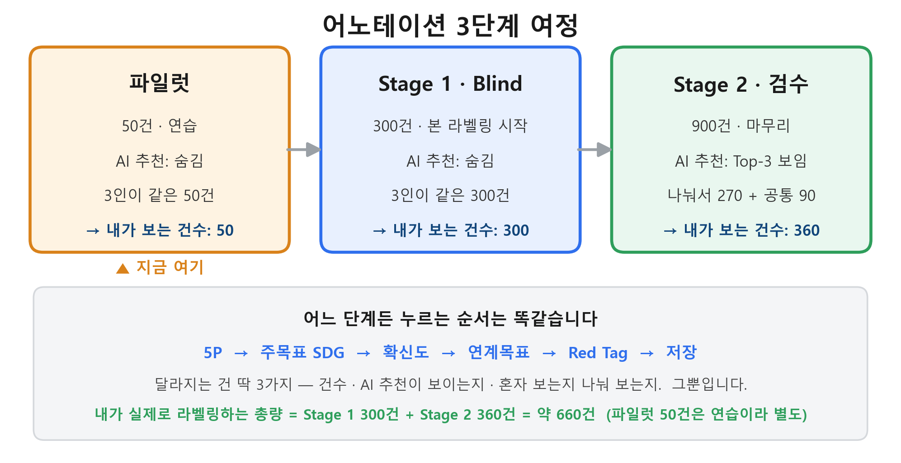

# SDG 예산 어노테이션 — 어노테이터 종합 안내 (v3)

> **이 문서 하나로** "어노테이션이 무엇이고, 전체가 어떻게 흘러가며, 당신이 매번 무엇을 누르는지"를 파악할 수 있도록 정리했습니다.
> 처음 오신 분은 **0 → 1 → 2** 만 읽어도 큰 그림이 잡힙니다. 실제 작업 직전에 **3 → 4** 를 보세요.
> *내용 버전 = v3 종합 안내본. (파일명은 연혁상 `annotator_notice_v2_kickoff`이지만 내용은 v3입니다.) 일정·팀 구성은 확정 후 채웁니다.*

---

## 0. 어노테이터란? (1분 개념)

- **어노테이터** = 예산사업 설명을 읽고, 그 사업이 **어떤 UN 지속가능발전목표(SDG)에 해당하는지 "정답 라벨"을 붙이는 사람**입니다.
- **왜 사람이 하나요?** AI가 자동 분류를 *배우려면*, 먼저 **사람이 만든 정답지**가 있어야 합니다. 이 정답지를 **Gold Standard(골드 스탠다드)** 라고 부르고, 그걸 만드는 게 여러분의 일입니다.
- **왜 여러 명이 하나요?** 한 사람의 판단은 주관적일 수 있어서, **여러 명(현재 설계상 3명)이 각자 독립적으로** 같은 사업을 라벨링한 뒤 **얼마나 일치하는지(신뢰도)** 를 측정합니다. 일치도가 높을수록 믿을 만한 정답지가 됩니다.
- 또한 3명은 무작위가 아니라 **서로 다른 전문 영역**(행정·재정 / SDGs·환경 / 예산 실무)을 대표하도록 구성됩니다 — 한 시각의 편향을 줄이기 위함입니다. *(구체적 명단은 §7 확정 후 기입)*
- 그래서 이건 **"정답을 맞히는 시험"이 아닙니다.** *신중하고 일관되게 판단하는 것*, 그리고 **모르면 솔직하게 표시하는 것**이 가장 좋은 작업입니다. (모르는 걸 찍는 게 데이터를 가장 망칩니다.)

---

## 1. 전체 3단계 여정 (한눈에)

작업은 **파일럿 → Stage 1 → Stage 2** 순서로 흘러갑니다. **누르는 순서는 늘 똑같고, 달라지는 건 딱 3가지(건수 · AI 추천이 보이는지 · 혼자 보는지 나눠 보는지)뿐입니다.**

| 비교 항목 | 🧪 파일럿 | 🟠 Stage 1 · Blind | 🟢 Stage 2 · 검수 |
|---|---|---|---|
| **건수(전체)** | 50건 | 300건 | 900건 |
| **AI 추천** | 🙈 안 보임 | 🙈 안 보임 | 🤖 **Top-3 보임** |
| **표본 배분** | 3명이 **같은** 50건 | 3명이 **같은** 300건 | 3명이 **나눠서**(1인 270건) + **공통 90건** |
| **내가 보는 건수** | 50건 | 300건 | **360건** (270 + 90) |
| **목적** | 도구·기준 손에 익히기 | AI 영향 없는 **순수 판단** 확보 | AI 도움 받아 **빠르게 마무리** |

> 👉 **내가 실제로 라벨링하는 총량 = Stage 1 300건 + Stage 2 360건 = 약 660건** (파일럿 50건은 연습이라 별도). 하루 7~8건씩 하면 단계마다 몇 주가 걸리는지 가늠하실 수 있습니다.
>
> ✅ **핵심**: 어느 단계든 당신이 누르는 순서는 같습니다 — ① 5P → ② 주목표 SDG → ③ 확신도 → ④ 연계목표 → ⑤ Red Tag → 저장. 파일럿에서 익히면 Stage 1·2는 "건수가 늘고, Stage 2엔 AI 추천이 추가될" 뿐입니다.

---

## 2. 각 단계 자세히

### 🧪 파일럿 (50건) — 연습 + 점검
- 본격 작업 전에 **도구 사용법과 코딩북(판단 기준)에 익숙해지는** 단계입니다.
- AI 추천은 **숨겨져** 있고, 3명이 **똑같은 50건**을 각자 라벨링합니다.
- 이 결과로 "3명의 판단이 얼마나 일치하는지(신뢰도)"를 측정합니다. 기준을 넘으면 본 라벨링으로 진행합니다.

> ※ **(검토 중)** 파일럿 팀과 본 라벨링 팀의 구성이 달라질 경우, Stage 1 직전에 본 라벨링 팀 전원이 **공통 소량(20~50건)을 한 번 맞춰보는 "캘리브레이션 라운드"** 가 추가될 수 있습니다. 확정되면 별도 공지합니다.

### 🟠 Stage 1 · Blind (300건) — 본 라벨링 시작
- **여기서부터 진짜 정답지 데이터**입니다.
- 파일럿과 똑같이 **AI 숨김 + 3명이 같은 300건**. 차이는 "이제 진짜이고, 건수가 많다"는 것뿐입니다.
- *Blind(블라인드)* 는 "AI도, 다른 사람의 답도 안 보고 **혼자 판단**한다"는 뜻입니다. AI에 휩쓸리지 않은 순수한 사람 판단을 확보하기 위함입니다.

### 🟢 Stage 2 · 검수 (900건) — AI 도움 받아 마무리
- 이 단계부터 화면에 **AI가 예측한 Top-3 후보**가 뜹니다. **맞으면 클릭 한 번, 틀리면 직접 선택** — 그래서 훨씬 빠릅니다.
- **배분**: 900건 중 **810건은 3명이 270건씩 나눠** 맡고, 나머지 **90건은 3명이 똑같이** 봅니다(서로 얼마나 일치하는지 한 번 더 확인하기 위해). → **한 사람이 Stage 2에서 보는 건 270 + 90 = 360건**입니다.
- ⚠️ **주의 1**: AI 추천은 *참고*입니다. AI가 틀릴 수 있으니, **사업 내용을 보고 본인이 판단**하세요. "AI가 그렇다니까" 식으로 무조건 따라 누르면 안 됩니다.
- ⚠️ **주의 2**: 이 Top-3는 **별도의 AI(GPT-4o)가 코딩북만 보고 미리 독립적으로 만든 후보**입니다. **Stage 1에서 여러분이 단 답이 되돌아오는 게 아닙니다** (여러분 답과 무관합니다).

---

## 3. 당신이 매번 하는 일 (작업 순서)

화면 왼쪽에서 사업 설명(사업명·목적·내용)을 읽고, 오른쪽에서 아래 순서대로 입력합니다.

| 순서 | 입력 | 설명 |
|---|---|---|
| **(먼저)** | 좌측 **수혜자 체크리스트** | "이 사업의 진짜 수혜자가 누구인가" 먼저 확인 → 오분류 예방 |
| **①** | **5P 영역** | People / Prosperity / Planet / Peace / Partnership 중 1개 |
| **②** | **주목표 SDG (1개)** | 위 영역 안의 SDG 중 가장 핵심 1개. (해당 없으면 "NA") |
| **③** | **확신도** | 확실함 / 애매함 / 모르겠음 |
| **④** | **연계목표 SDG (0~2개)** | **Nexus 체크리스트**를 먼저 읽고, 해당될 때만 추가. "혹시 몰라 추가"는 금지 |
| **⑤** | **Red Tag** | 아래 4종 중 해당 시 (없으면 RT-NONE) |
| **(저장)** | 저장 → 다음 / 임시 저장 | |

### Red Tag — 4종 (※ 과거 3종에서 **D 추가**)

| 코드 | 이름 | 뜻 |
|---|---|---|
| **A** | SDG 상충 (Nexus Trade-off) | 한 SDG 달성이 다른 SDG를 **저해** |
| **B** | SDG 워싱 (Washing) | 이름만 SDG, **실제 활동은 무관** |
| **C** | 역행 투자 (Anti-SDG) | 특정 SDG에 **명백히 역행** |
| **D** | 데이터 불충분 *(신규)* | 텍스트가 너무 짧거나 정보 부족으로 **판정 곤란** |

- Red Tag(A/B/C/D)를 고르면 **판단 근거 한 줄**을 반드시 적어주세요.

### ⚠️ 헷갈리기 쉬운 세 가지 — "모르겠음 / NA / Red Tag D"

| 무엇 | 어디에 | 언제 쓰나 |
|---|---|---|
| **확신도 "모르겠음"** | ③ 확신도 | SDG 대상이긴 한데 **어느 SDG인지 확신이 약할 때** (그래도 SDG는 하나 고름) |
| **주목표 "NA"** | ② 주목표 | 17개 SDG **어디에도 해당하지 않을 때** |
| **Red Tag "D"** | ⑤ Red Tag | **텍스트가 너무 짧아 판단 자체가 불가능**할 때 |

→ 한 줄 요령: **정보가 아예 부족하면 D, SDG 대상이 아니면 NA, 대상이긴 한데 확신이 약하면 "모르겠음".**

### Nexus 체크리스트 (연계목표 추가 기준)
연계목표 섹션 위에 늘 떠 있습니다. **하나라도 YES일 때만** 연계목표를 추가하세요. (화면 문항 그대로입니다.)
- **Q1**: 수혜자가 2개 이상 SDG 영역(People/Prosperity/Planet/Peace/Partnership)에 걸쳐 있는가?
- **Q2**: 사업 수단(인프라·훈련·플랫폼 등)이 주목표 외 다른 SDG에 **기여 또는 저해**하는가?
- **Q3**: 사업목적 텍스트에 2개 이상 SDG 키워드(예: 기후+에너지, 교육+고용)가 **명시**되는가?

---

## 4. 내가 남과 다르게 라벨하면 어떻게 되나요? (합의 과정)

**가장 많이 걱정하시는 부분이라 따로 설명합니다. 결론부터: 달라도 전혀 괜찮습니다. 그러라고 3명이 하는 겁니다.**

3명의 라벨이 갈리는 건 **정상이고 기대된 일**입니다. 갈린 사업은 아래 **규칙**에 따라 자동·체계적으로 정리됩니다 — *누가 우겨서가 아니라, 미리 정한 규칙으로* 정리됩니다.

| 상황 | 어떻게 처리되나 |
|---|---|
| **2:1 (다수 있음)** | 다수 라벨을 채택 (예: A·C가 SDG1, B가 SDG8 → SDG1) |
| **3명 3색 / 애매** | 판정 회의에서 **공식 SDG 분류 기준**(국제 기준 OSDG · 국내 기준 K-SDGs · 우리 코딩북)을 **함께 적용한 뒤 다시 투표(재라벨)** 해 결정 |
| **그래도 모호** | **억지로 합의하지 않고** "데이터 불충분(Red Tag D)"이나 "NA"로 **정직하게 보존** |

핵심 원칙 세 가지:
1. **사람 한 명이 정답을 정하지 않습니다.** 판정 회의는 *누가 우기는 자리가 아니라, 같은 기준을 적용해 다시 투표하는 자리*입니다. (연구자도 마음대로 못 바꿉니다.)
2. **모호한 건 모호하다고 남깁니다.** 못 가르는 걸 억지로 가르는 게 더 나쁩니다.
3. 그래서 **"남과 똑같이 맞춰야 한다"는 부담을 갖지 마세요.** 오히려 다른 사람 답을 신경 쓰면 데이터가 망가집니다(아래 Blind 원칙).

> 즉 **당신의 솔직하고 독립적인 판단 그 자체가 데이터**입니다. 일치/불일치를 정리하는 건 당신의 일이 아니라 *규칙의 일*입니다.

---

## 5. 준비 (첫 접속 전 1회)

### 5.1 브라우저 캐시·로컬 저장소 초기화 (필수)
이전 세션 데이터가 남아 있으면 새 화면이 오작동할 수 있습니다.

**간단**: 배포 URL 접속 → `Ctrl + Shift + R`(강력 새로고침) → 화면에 버전 표시가 뜨는지 확인.

**확실** (간단으로 안 되면): `F12` → **Application** 탭 → **Local Storage** → 배포 도메인 선택 → `sdg_pilot_v2_*`, `sdg_main_*`, `sdg_demo_*`로 시작하는 키 삭제 → **Session Storage**도 동일 → 탭 종료 후 재접속.

### 5.2 접속·로그인
1. 배포 URL 접속
2. **모드 선택** 드롭다운에서 **운영자가 지정해 드린 단계**를 고르세요 (현재 단계는 §7 참조). 어느 단계인지 헷갈리면 연구 책임자에게 확인하세요. — *본인이 임의로 고르는 것이 아닙니다.*
3. 본인 이름 입력 → 슬롯 자동 매칭
4. "0 / N 진행" 초기 화면이 뜨면 시작

---

## 6. 꼭 지켜주실 것 (Blind 원칙)

신뢰도(3명 일치도)를 정확히 재려면, **서로의 답에 영향을 주면 안 됩니다.**

- ❌ 서로의 라벨 결과 공유 (완료 전·중·후 모두)
- ❌ 특정 사업의 "정답"을 서로 논의 / "이건 SDG 몇 같아?" 문의
- ✅ **코딩북 해석·애매한 정의 질문**은 연구 책임자에게 **1:1로** (카톡/이메일)
- ✅ **모르는 건 "애매함" 또는 "모르겠음"으로 솔직하게** — 모르는 걸 "확실함"으로 찍는 게 신뢰도를 가장 크게 망칩니다.

(4번 "합의 과정"과 연결됩니다: 당신은 **혼자 솔직하게** 판단만 하면 되고, 갈린 건 나중에 규칙이 정리합니다.)

---

## 7. 로그인 정보 · 일정 · 팀 구성  〔확정 후 기입 — 현재 비워둠〕

> ※ 본 안내문은 **3인 기준**으로 설명했습니다. 최종 인원·명단·일정은 **확정 후 이 칸을 채워 다시 보냅니다.** (구성·일정이 검토 중이라 현재 placeholder입니다.)

| 항목 | 내용 |
|---|---|
| **현재 진행 단계** | 〔확정 후 기입 — 예: 🧪 파일럿〕 |
| 어노테이터 구성 | 〔확정 후 기입 — 연구자 참여 여부 및 외부 전문가 명단〕 |
| 본인 로그인 슬롯 | 〔확정 후 기입〕 |
| 단계별 일정 | 〔확정 후 기입 — 킥오프 / 마감〕 |
| (검토 중) 캘리브레이션 라운드 | 본 라벨링 팀이 파일럿 팀과 다를 경우, 본 라벨링 직전 공통 소량(20~50건) 맞춤 1회 (§2 참조) |

---

## 8. 문의 · 참고

| 상황 | 연락 / 참고 |
|---|---|
| 코딩북 해석·애매한 정의 | 연구 책임자 (카톡/이메일) |
| UI 오류·저장 안 됨·로그인 실패 | 연구 책임자 (스크린샷 첨부) |
| SDG 17개 정의 복습 | 코딩북 `coding_book_v1_9.docx` 제1장 |
| Nexus 판정 사례 | 코딩북 제4장 판정 예시 |

---

## 부록 A. 자주 헷갈리는 용어

| 용어 | 쉬운 설명 |
|---|---|
| **Gold Standard** | 사람이 만든 "정답지". AI가 이걸 보고 배웁니다. |
| **IAA / κ(카파)** | 3명이 얼마나 일치하는지 나타내는 신뢰도 점수. |
| **Blind(블라인드)** | AI도, 남의 답도 안 보고 혼자 판단. |
| **주목표 / 연계목표** | 사업의 핵심 SDG 1개 / 부수적으로 기여하는 SDG 0~2개. |
| **NA** | 17개 SDG 중 어디에도 해당 안 됨. |
| **Adjudication(판정)** | 갈린 라벨을 규칙으로 정리하는 과정 (4번 참조). |
| **OSDG** | UN 계열의 SDG 자동분류 공개 기준(국제 참고 기준). |
| **K-SDGs** | 한국형 지속가능발전목표 지표(국내 참고 기준). |

## 부록 B. 변경 이력
- **v3 (종합 안내)**: 어노테이터 개념(§0)·3단계 여정(§1~2)·합의 과정(§4) 신설, Red Tag 4종(D)·"모르겠음/NA/D" 구분 박스 반영, Nexus 문항을 도구 UI 기준으로 정합, Stage 2 배분(270 분담+90 공통=360/인)·1인 총 660건 명시, 코딩북 v1.9로 갱신. 일정·팀 구성은 placeholder.
- v2 (2026-04): 파일럿 킥오프 단발 안내.
